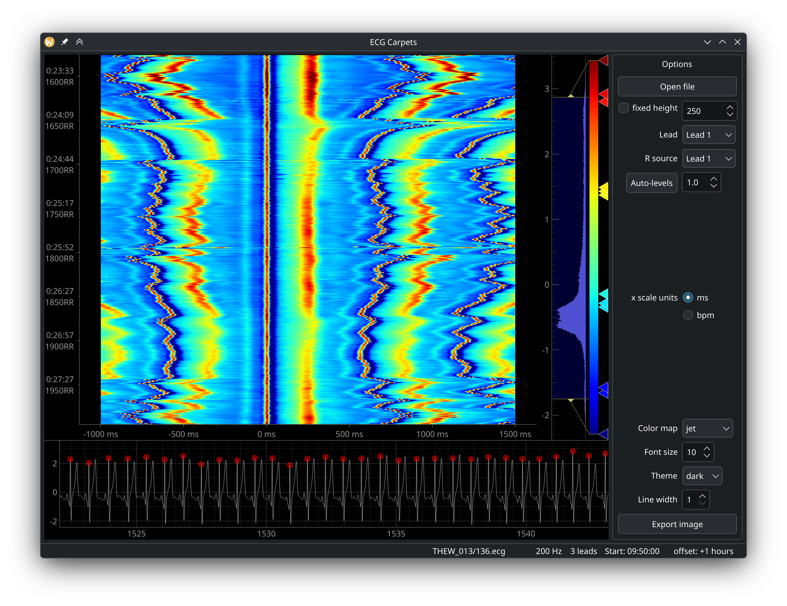

# Carpets GUI



## Requirements
- pyside6
- pyqtgraph
- neurokit2
- wfdb
- ishneholterlib

## Supported ECG file formats
- wfdb
- ishne
- AMEDTEC ECGPro

## Running the application
```bash
python main.py
```

## Known issues
- PySide6 6.9.1 breaks PyQtGraph
- upstream IshneHolterLib is not compatible with current NumPy, we provide patched version 